

    

# Game Design Document (GDD)

## Table of contents

- [Game Overview](#game-overview)
  - [Core Concept](#core-concept)
  - [Genre](#genre)
  - [Target Audience](#target-audience)
  - [Unique Selling Points](#unique-selling-points)
- [Story and Narrative](#story-and-narrative)
  - [Backstory](#backstory)
  - [Characters](#characters)
- [Gameplay and Mechanics](#gameplay-and-machanics)
  - [Player Perspective](#player-perspective)
  - [Controls](#controls)
  - [Progression](#progression)
  - [Gameplay Mechanics](#gameplay-mechanics)
- [Levels and World Design](#levels-and-world-design)
  - [Game World](#game-world)
  - [Objects](#objects)
  - [Physics](#physics)
- [Art and Audio](#art-and-audio)
  - [Art Style](#art-style)
  - [Sound and Music](#sound-and-music)
  - [Assets](#assets)
- [User Interface](#user-interface)
- [Technology and Tools](#technology-and-tools)
- [Team Communication, Timelines and Task Assignment](#team-communication-timelines-and-task-assignment)
- [Possible Challenges](#possible-challenges)
- [Changes since A1](#changes-since-A1)

## Overview

### Core Concept

The concept of this game revolves around a quality food delivery service, and "surviving" by keeping up your cars fuel levels by using the money you earn from delivering food to customers to pay for more fuel. the player wins if they manage to maintain their fuel levels above 0 for 5 minutes. Customers not only want their food to be fresh and hot but also in the same condition it had left the restaurant in. This means that couriers can't simply drive as fast as they can to customer's houses, as the food will become damaged and not edible. Therefore, couriers are required to drive quickly, but also in a manner that keeps the food quality high. After surviving for five minutes players can judge their level of success by the total amount of money they had saved up at the end of the game.

  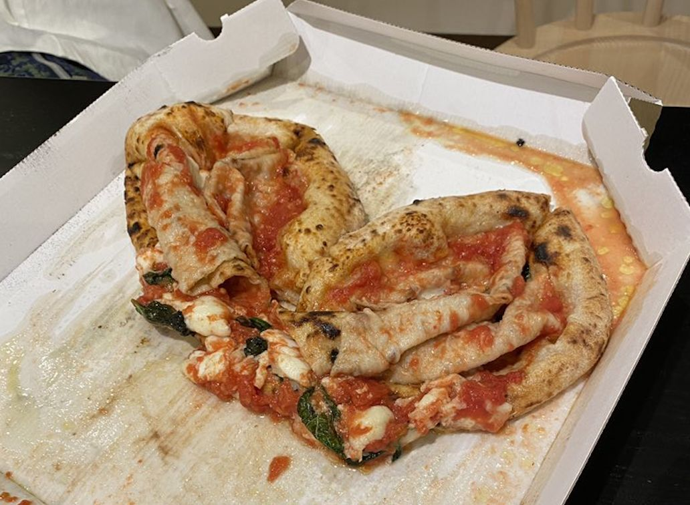
  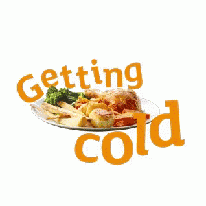
  <em> Customers do not want cold or damaged food. It's your job to deliver it to them in the best way possible.</em>

The main character is a 'Dior Dieshe' driver aiming to provide great food delivery to customers.
The player needs to complete orders quickly and to a high standard. If orders are not completed on time, the food becomes cold and you fail due to customer dissatisfaction (more on the story later).

### Genre

Delivery Dash is a Racing game with survival elements. Other games in this genre are Mario Kart and Need for Speed. Although many aspects will be similar, this game has its own Unique Selling Points discussed below.

  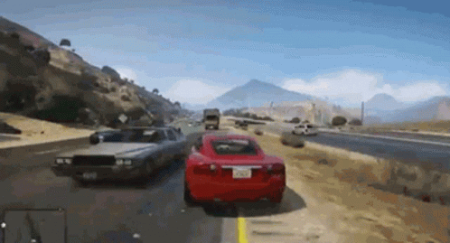  
  <em> Delivery Dash aims to replicate the way driving can get chaotic in games like GTA and Need for Speed, but with more family-friendly themes.</em>

### Target Audience

Our target audience is primarily students, between the ages of 8-15.

### Unique Selling Point

The main Unique Selling Point of Delivery Dash is the need to drive carefully as well as fast. There's not much point in making deliveries extremely quickly if the food becomes damaged during the ride. If the quality of food is poor when delivered, a low to no tip is to be expected. Meaning it is far harder to pay for fuel. Players will be required to find a happy medium in-between speed and drive safely in order to maximise tips.

## Story and Narrative

### Backstory

**Setting**:
The city in our game is based on the city of Melbourne, which is a bustling metropolis known for its insatiable love for diverse cuisines, but also for its chaotic traffic and narrow by-lanes. Skyscrapers, food stalls, quaint cafes, and the urban hum form the backdrop.

  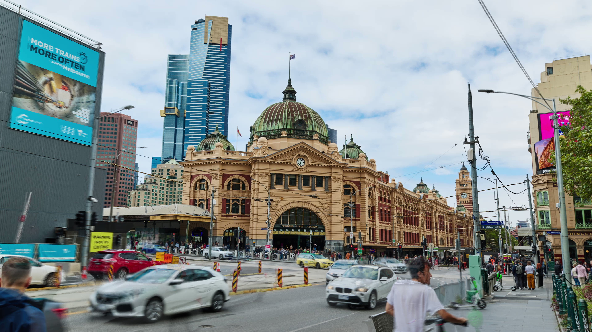  
  <em> The city of Melbourne provides a great varied setting for Delivery Dash.</em>

  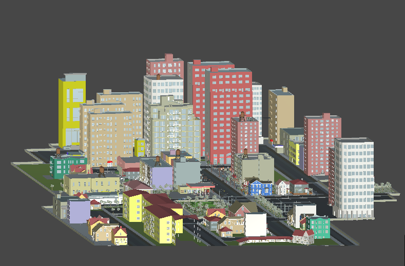  
  <em> The city in our game</em>

**Origins**:
Steve had always been a car enthusiast, inspired by tales of his grandfather's legendary driving skills as a cab driver in the older, less chaotic parts of Melbourne. Growing up, he'd heard stories of the golden era when quality mattered over speed, and the focus was on customer satisfaction.

**Conflict**:
In today's Melbourne, the scene has changed. The food delivery race is all about speed, often at the cost of quality. With so many delivery apps at customer’s disposal, the competition is fierce. The drivers hustle, focusing on faster deliveries, often ignoring the state of the food being delivered. Steve sees a recurring problem: customers receiving their food either cold or in a messy state, leading to widespread dissatisfaction.

Steve had a sudden realisation that he could vastly increase his income if he delivered food quickly, and with care. Steve sees an opportunity to make a difference, he discovers 'Dior Dieshe' to start his journey as a brilliant delivery man. Every delivery becomes a race against time, traffic, and the temptation to compromise on quality for speed.

**Progression**:
As the game continues to move forward, Steve will face different challenges from different customers as their orders will be more demanding in terms of delivery speed, distance, and other specifications. The customer needs will vary as some would be forgiving with minor delays but would expect exceptional food quality, on the other hand, some consumers would pay for a priority delivery and would want exceptional food quality alongside fast deliveries. Keeping in mind satisfying the priority customers is important as they tend to leave larger tips. Every delivery and every order builds up to the climax…….

**Resolution**:
The outcome of this delivery determines Steve's reputation in Melbourne. Winning cements his status as the delivery driver who brought back the era of quality. Losing, however, isn't the end; it's an opportunity for Steve (and the player) to regroup, strategise, and retry, ensuring customers get the quality they deserve.

Throughout the game, players aren't just racing; they're navigating the challenges of a city in a race against compromised standards, representing the battle between the old values of quality vs. the modern-day rush.

### Characters

There will be a few key characters in Delivery Dash. The player is the delivery driver, picking up food from restaurants and delivering it to other characters. These other characters are customers that are placed around the map who make the orders the player needs to deliver. These customers will reward the player with tips based on that customers unique:

- Expectation of food warmth
- Expectation of food quality

Player Cars:

- Small car (fast, poor suspension, can carry 2 food items)
- Station Wagon (medium speed, medium suspension suspension, can carry 3 food items)
- Bus (slowest, best suspension, can carry 4 food items)

  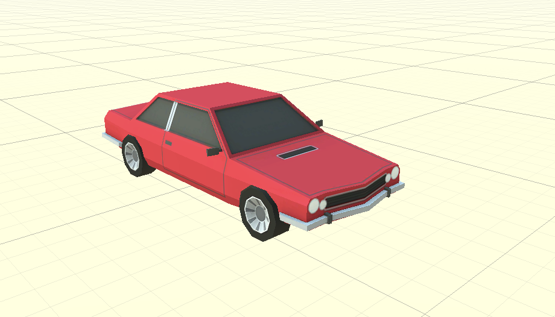
  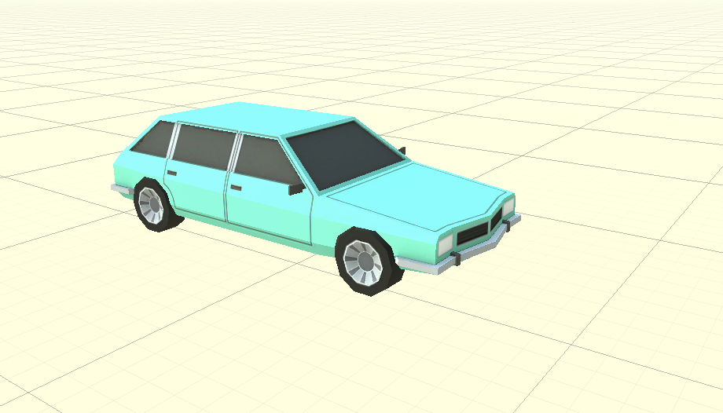
  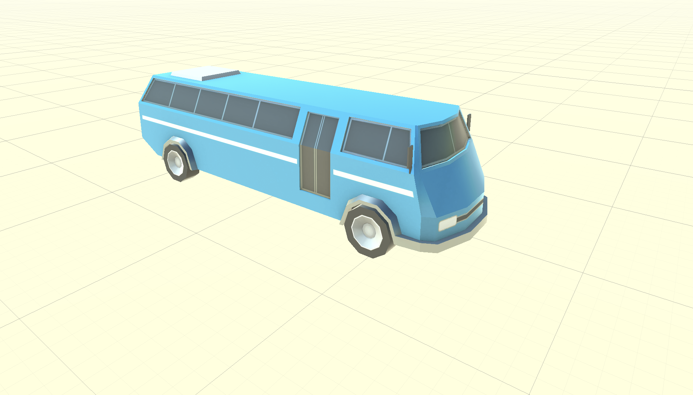
  <em>  &emsp; &emsp; &emsp; &emsp; &emsp; Small Car &emsp; &emsp; &emsp; &emsp; &emsp; &emsp; &emsp; &emsp; &emsp; Station Wagon &emsp; &emsp; &emsp; &emsp; &emsp; &emsp; &emsp; &emsp; &emsp; Bus &emsp; &emsp; &emsp; &emsp; &emsp; &emsp; &emsp;</em>

Each customer has different expectations on food quality:
| John | Bob | Steve | Janet | Betsy |
| ------------- | ------------- | ------------- | ------------- | ------------- |
| <ul><li>Very Easy</li><li>Little Expectation on food status</li></ul> | <ul><li>Easy</li><li>Expects warm food</li></ul> | <ul><li>Intermediate</li><li>Expects mostly undamaged and hot food</li></ul> | <ul><li>Hard</li><li>Wants vey warm and undamaged food</li></ul> | <ul><li>Very Hard</li><li>Expects near perfect delivery</li></ul> |

## Gameplay and Mechanics

In Delivery Dash the gameplay is centred on making delivering food items exciting, engaging and tacticful. The mechanics need to reflect this by being responsive to player inputs and rewarding those who develop effective startgeies and technical skills.
Elements of a survival game are in play by giving players a fuel gauge. Failing to complete the deliveries means no money to refuel. Players continualy recieve new deliveries as the game progresses.

### Player Perspective

The camera uses a 3rd person perspectve focused on the back side of the vehicle the player is currently in control over. This perspectve is hopefully familiar to regular gamers as it is found in not only racing games, like the Mario Kart series, but also in open-world games with driving mechanics, such as Grand Theft Auto V. In this perspective players have little control over the angle of the camera which helps keep the focus on their vehicle rather than giving free control over what direction the camera is pointing.

  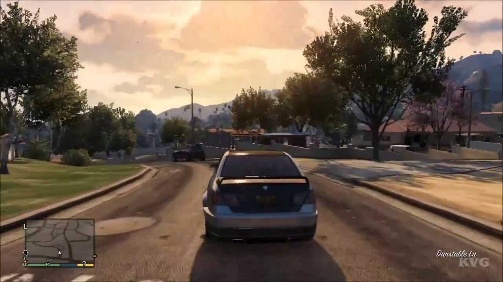
  <em> &emsp; </em>
  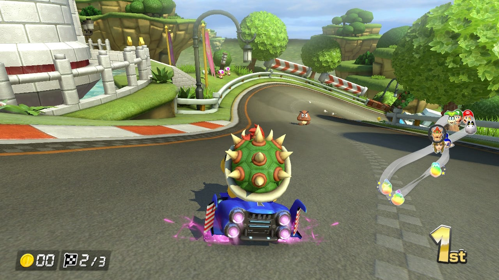
  <em>  &emsp; &emsp; Driving in Grand Teft Auto V &emsp; &emsp; &emsp; &emsp; Bowser Racing around in Mario Kart 8</em>

### Controls

The Player uses WASD controls, as is standard, to control the movement of their vehicle.

- W: to accelerate forward
- S: to reverse backwards
- A: To turn left
- D: To turn right

A few more control options are available:

- Shift: To quickly brake
- E: To use picked-up powerups like speed boosts
- Q: Refuel while at the petrol station.

### Progression

As the game only lasts 5 minutes there is little reason to build a system where players have to level up skills and abilities over time. Rather, players gain short-term, one-time use abilities by collecting powerups as they are driving around.
Whilst the game finishes once five minutes are up or the player runs out of fuel, the tip system can be used like a high score system which encourages players to continue to play and progress their skills to find ways to gain even more tips. Moreover, as players select from one of three vehicles each time they play, they are encouraged to experiment with the game to see which vehicle matches their play style the best.

### Gameplay Mechanics

Delivery Dash involves a variety of mechanics to keep players engaged in the core gameplay loop:

- **Vehicles**: Players can pick from a range of vehicles. Each with different stats such as speed, handling and carrying capacity (how many deliveries it can hold at once).
- **Delivery Items**: The items the players deliver around the town come from a variety of takeaway stores, such as pizza, or fish and chips. Each item has different qualities making them either lose warmth or be more susceptible to damage. A food's warmth is based on how long it has been since it was picked up from a restaurant. Its damage is based on how many in game objects the player runs into. Whilst delivering food the player is directed to their objective location by colour coded arrows that appear in the front of their, if they have not picked up gthe food it will point to the restaurant they need to go to, otherwise it will point at the customer.

  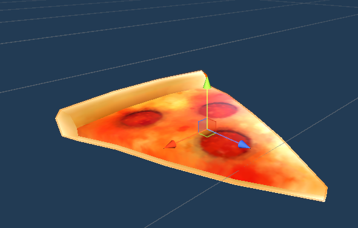  
  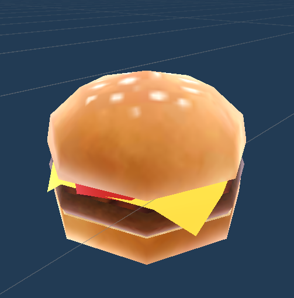  
  <em> Some example of food; Pizza, Burger</em>

  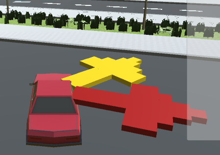  
  <em> Two colour coded arrows that point towards objectives for two different orders</em>

| Pizza       | Burger         | Hot Dog         | Chips        | 
| ------------- | ------------- | ------------- | ------------- | 
| <ul><li>From Prime Pizza</li><li>Loses heat slowly</li><li>Takes reasonable damage</li></ul>  | <ul><li>From Bill's Burgers</li><li>Loses heat at a medium pace</li><li>Pretty susceptible damage</li></ul>  | <ul><li>From Happy Hotdogs</li><li>Loses heat slowly</li><li>Not very susceptible to damage</li></ul>  | <ul><li>From Chippy's Chips</li><li>Loses Heat very quickly</li><li>Not very susceptible to damage</li></ul>  |

- **Customers**: Similar to how different food items vary in how they deal with warmth and damage, different customers may react differently depending on the status of the food. Some customers can be more accepting of damage but less accepting of loss of warmth resulting in different tip amounts. Every play-through has the same customers but the orders they place can come from different stores each time, meaning players have to plan different routes each time they play through the game.

  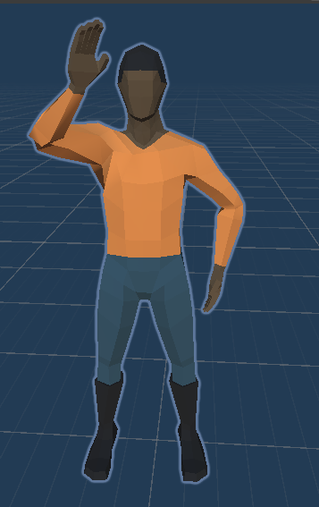  
  <em> Characters will be in low-poly style as shown</em>

- **Fuel**: As the player drives around the map their vehicle will lose fuel, if it drops to 0 the game ends and they only win the game if they keep thier fuel levels above 0 for five minutes. In order to get more fuel players can either use boosts or regularly return to the petrol station in the center of the map where they can spend $25 to refuel 30L. The fuel in the car drops by 1L each second so players have to ensure they are carefully monitoring their levels. (Note: The Fuel mechanic was implmeneted later in the games development to better reflect the survival genre requirment).

 
 <em> Fuel levels are tracked by the minimap </em>

 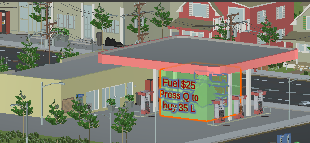
 <em> The Fuel station in the middle of the map </em>

- **Power ups**: Scattered around the game world are power ups that players can use to help them navigate around the map. These power ups are single use that the players can activate when they choose, and are positioned around the map to encourage players to take routes they normally wouldn't. The powerups are:

| Speed Boost                                        | Heater                                        | Tongs                                        | Fuel                                                  |
| -------------------------------------------------- | --------------------------------------------- | -------------------------------------------- | ----------------------------------------------------- |
| 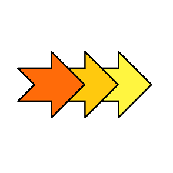 |  | 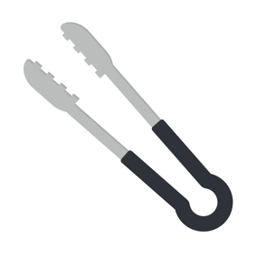 | 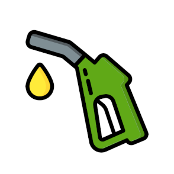 <tr></tr> |
| Immediate boost in speed                           | Restore heat to food                          | Reverse damage done to food                  | Gives the players some fuel back                      |

- Additionally the Heater and Tongs power up, if used when they player is not holding any food, gives the player a small bit of fuel.
   

* **Obstacles**: All the objects within the world's map serve as obstacles for the player. For example if a player is working their way down a tight street and they collide with a lamp post at a high enough speed the food they are carrying is going to take a lot of damage.

## Levels and World Design

### Game World

The game is set in a city scape, and will be captured through a 3rd person field of view, additionally the camera will be angled in such a way so that the road will take up a fair amount of the screen. The camera will follow the vehicle the player is controlling and use a wide focus. Larger obstacles will be easily seen from far away while smaller obstacles might not be visible until they are in the middleground of the screen.

The player always starts from the same location where they will receive their first delivery request from a customer and travel to a restaurant and pick up that customer's order before travelling to the customer's house. More orders will come at random intervals when driving, and you can end up with multiple orders at once. This adds chaos and decision making as you decide which orders require higher priority.

The map will be based off of Melbourne, with a more rural terrain further out. This can assist with providing different difficulty levels. The deliveries closer to the city (where the restaurants are) are shorter and easier to complete. Whereas the deliveries further out will take longer and mean the players have to more carefully plan their path.

### Objects

Objects in Delivery Dash can be separated into 4 categories

**Cars**: Cars in Delivery Dash serve as the game object the player controls. They will mostly be seen from behind and will look like cars with some "Dior Dieshe" promotion and advertisements.

**Pick up/Drop off zones**: Pick up and Drop off zones will be placed on the roads for cars to drive through. They will appear to be green transparent boxes, with the Pick up zone containing an image of the food ordered. Driving through these zones will activate either receiving an order and in doing so reveal the heat of the food, or will delivery the order and in doing so reveal the tip received for the order.

**Fuel Station Zone**: In the center of town is the fuel station area which the player can drive through in order to refuel. Whilst in the area the player can press "Q" to sped $25 to refuel.

**Power-ups**: Boosts and other power ups will be present floating on the road and will have a calm colour and a glowing effect. In order to use the powerup, the player will need to drive through the boost and collect it. After collecting the boost, it will disappear from the road and the specific power up obtained will be visible in the corner of the screen. The player can then choose when to use the power up by pressing the "E" key.

### Physics

When pressing on the accelerator (W key), the player's car will accelerate forward until it reaches its top speed. While turning, the player's top speed will be slightly decreased and upon activating the speed boost, the player's top speed will be temporarily increased.
If the player is not pressing the accelerator, the car will gradually slow down.

For the purpose of this game, trees and buildings will have infinite mass and cannot be moved, hence crashing into them will stop the player immediately.

## Art and Audio

The art, audio and assets we use for Delivery Dash are dictated by four considerations:

- The Target Audience: The graphics need to be appealing to younger and casual gamers, meaning they do not need to be too complex and technically impressive but rather should aim to be easily understandable.
- The Technical Limitations: As the game is supposed to be playable on WebGL, highly technical and impressive graphics are unachievable
- Time and Budget: As we have very limited time and budget to complete the game assets should be selected that are easy to implement but also free.
- The Style of the Game: Delivery Dash is supposed to feel chaotic and at times intense, hence the musical choices should have lots of energy behind them. Similarly, the sound effects used need to sound fun and do not need to be hyper serious.

### Art Style

Consider the technical constraints and the audience, a low poly art style is well suited to Delivery Dash. This style is visually clean and understandable, whilst also not being intensive to use. An example of such a style being used in racing and driving games is hotshot racing, which uses the style effectively in a chaotic environment. The visuals of the game's tracks also serve as inspiration for how we aim to have a low-poly version of the city of Melbourne.

  <a href="https://www.youtube.com/watch?v=UkZ6HkpXvj0">
    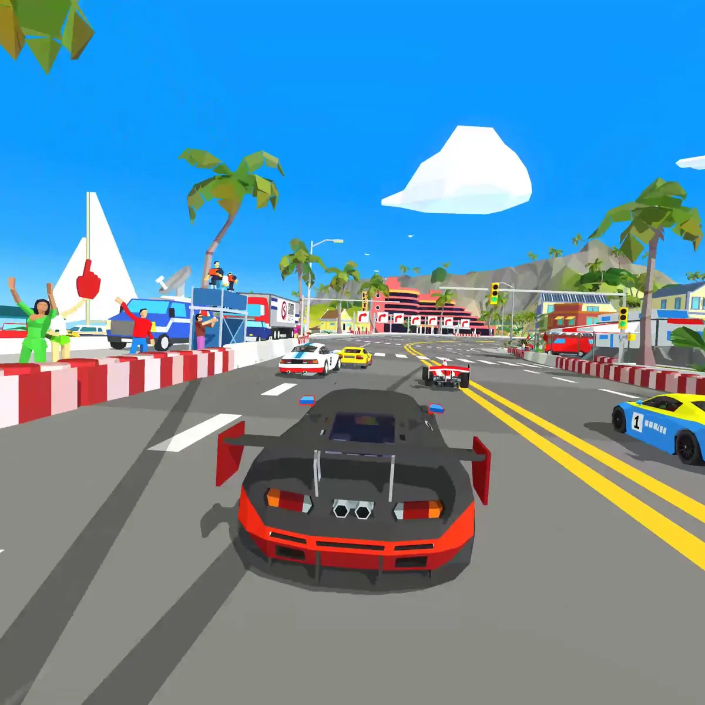  
    <em>  Hotshot racing. </em>
  </a>

For the art-style of our takeaway food we want it again to be simple but also enticing. It will also be in a low-poly style. One inspiration for the design of our food is the game Overcooked which many features minimal but delicious looking meals.

    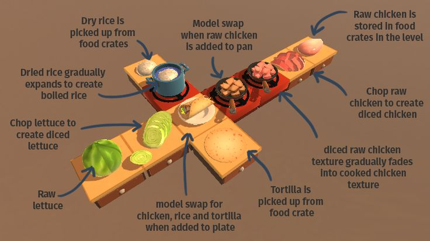  
    <em> Overcooked's food designs</em>
    

### Sound and Music

The music of Delivery Dash aims to exciting enough to keep players focused and engaged whilst playing. Hence, it should feel frantic and come packed with energy to motivate players to deliver the food as fast (and safely) as possible. The tracks used should steer away though from anything too edgy or intense like the music in more serious racing games. Just as it has served as inspiration for many of our gameplay elements the music from all versions of Mario Kart serve as a great example of fast and exciting music in family-friendly driving game.

  <a href="https://www.youtube.com/watch?v=5oRk65MYWg0">
    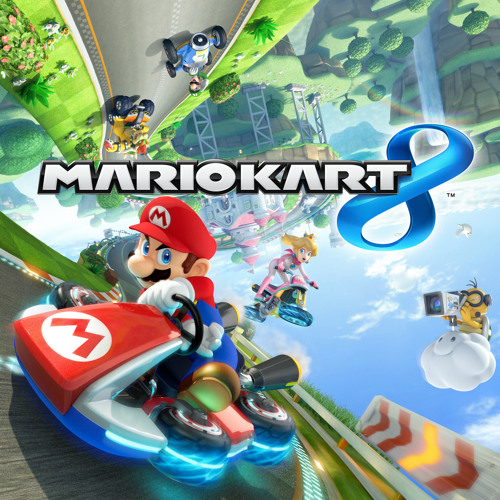  
    <em> Listen to the Mario Kart sound track here</em> 
  </a>

### Assets

As we have very little budget for our game a majority of our music and art assets are sourced from the Unity Asset Store, and specifically free options.
In order to build the city of Melbourne we utilise the <a href="https://assetstore.unity.com/packages/3d/environments/urban/city-package-107224"> CITY Package </a> as it has easy to use modular functionality for constructing cities.

    <a href="https://assetstore.unity.com/packages/3d/environments/urban/city-package-107224">
    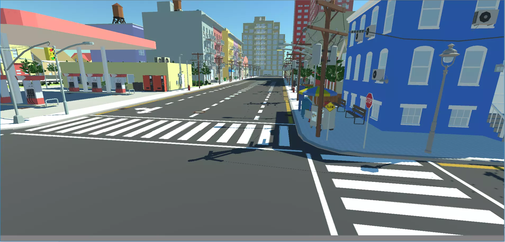  
    <em> The CITY Package from 255 Pixel Studios</em> </a>
    

For our cars and other vehicles we are using the <a href="https://assetstore.unity.com/packages/3d/vehicles/land/simple-cars-pack-97669"> Simple Cars Pack </a> which provides a few different base models for cars but also the ability to change the colours of those models to add more variety.

    <a href="https://assetstore.unity.com/packages/3d/vehicles/land/simple-cars-pack-97669">
    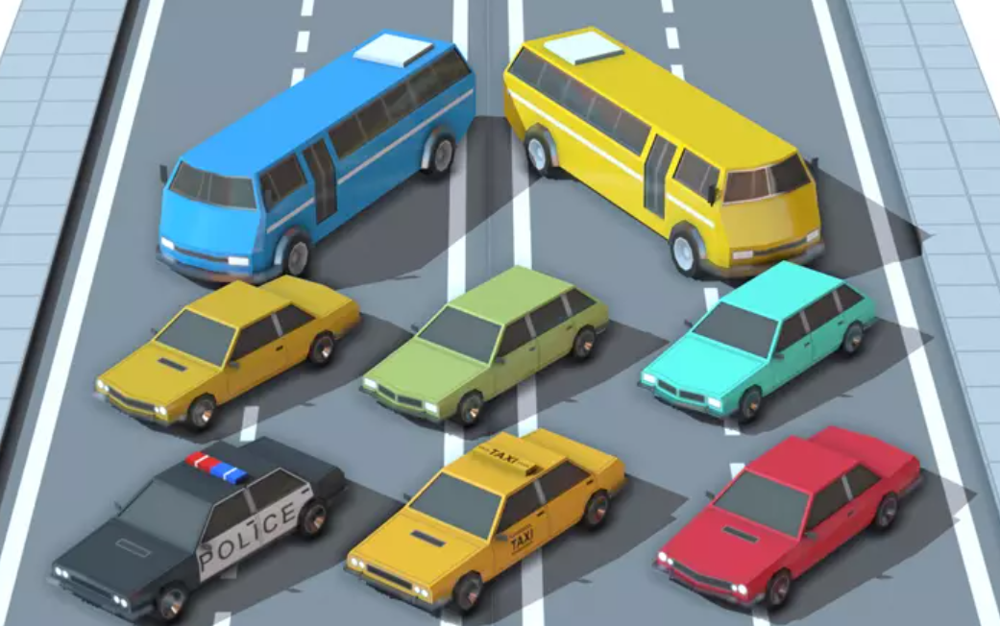  
    <em> Simple Cars Pack by MyxerMan</em> </a>
    

Whilst we do not currently plan to include walking around characters within the world, we still need models for representing characters. We can use the <a href="https://assetstore.unity.com/packages/3d/characters/distant-lands-free-characters-1781231"> Distant Lands Free Characters </a> to do so.

    <a href="https://assetstore.unity.com/packages/3d/characters/distant-lands-free-characters-1781231">
    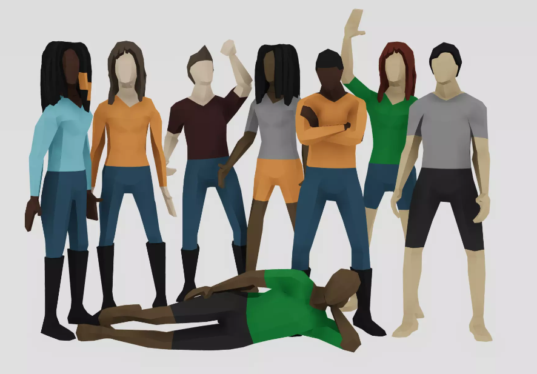  
    <em> Distant Lands Free Characters by Distant Lands</em> </a>
    

For food the appealing look we are going for can be found in the <a href="https://assetstore.unity.com/packages/3d/props/food/free-casual-food-pack-mobile-vr-85884"> Free casual food pack. </a>

    <a href="https://assetstore.unity.com/packages/3d/props/food/free-casual-food-pack-mobile-vr-85884">
    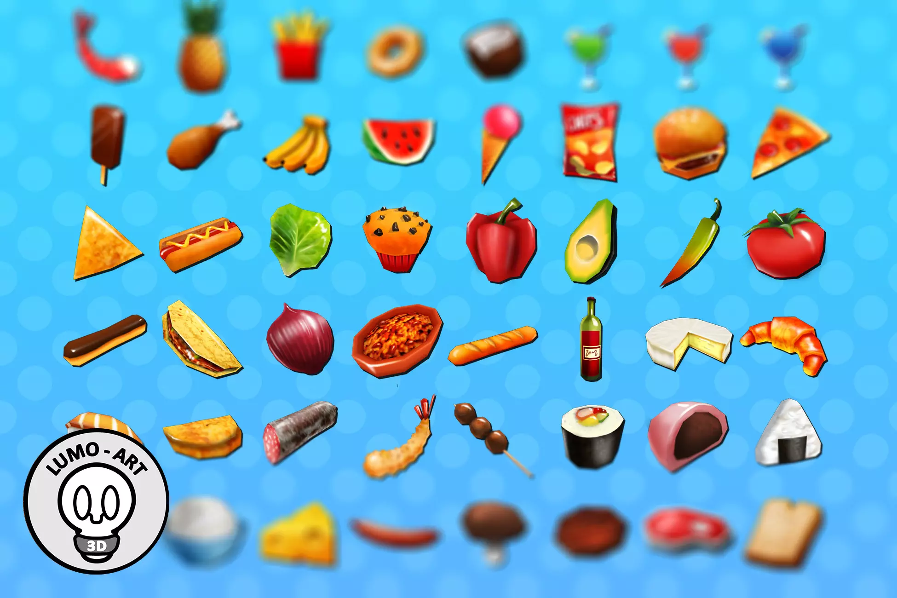  
    <em> FREE Casual Food Pack- Mobile/VR by Lumo-Art 3D</em> </a>
    

For the Fuel tank used to show the location of the fuel station we used <a href="https://assetstore.unity.com/packages/3d/props/fuel-tank-10l-230694"> Free casual food pack. </a>

    <a href="https://assetstore.unity.com/packages/3d/props/fuel-tank-10l-230694">
    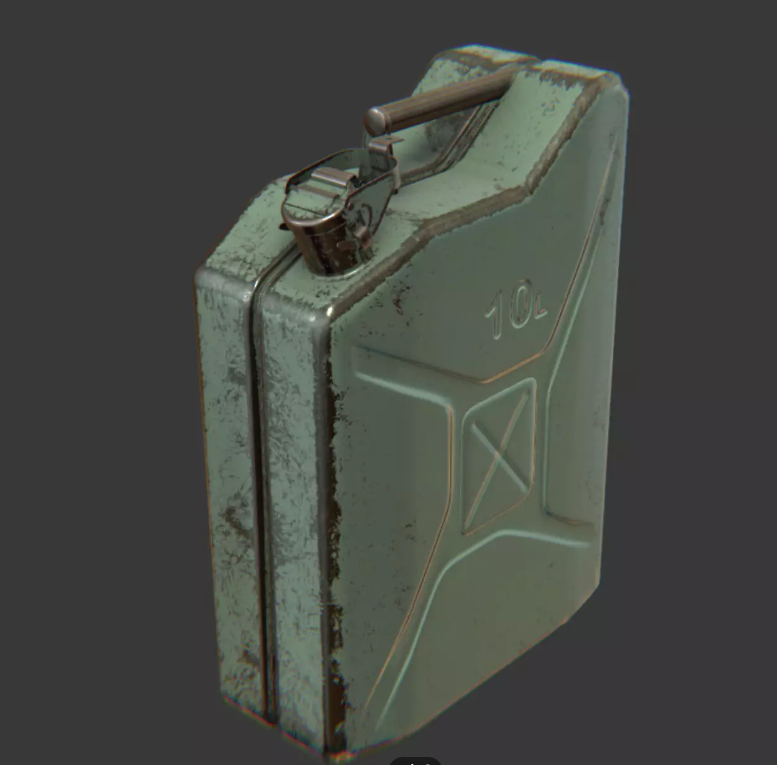  
    <em> Fuel Tank 10 L by AK STUDIO ART</em> </a>
    

In terms of sound effects, the <a href="https://assetstore.unity.com/packages/audio/sound-fx/transportation/vehicle-essentials-194951#content"> Vehicle - Essentials by Nox_Sound </a> provides a great many different sounds we can use to bring our cars to life in the game. To create the proper musical energy we wanted for our game we used the back ground music <a href="https://pixabay.com/music/video-games-cruising-down-8bit-lane-159615/"> Cruising down 8-bit lane </a> has short energy filled tracks to keep the player engaged in the chaos of Delivery Dash.
Additional sound effects we used are:

- [Car Crash EXT by Pixabay](https://pixabay.com/sound-effects/car-crash-ext-6388/) for the sound of the car colliding into map objects
- [Boost](https://pixabay.com/sound-effects/boost-100537/) when activating a speed boost
- [3 up 2](https://pixabay.com/sound-effects/3-up-2-89189/) when picking up a power up
- [steam_burst](https://pixabay.com/sound-effects/steam-burst-6822/) for when a heater boost is used
- [Sword Hit](https://pixabay.com/sound-effects/sword-hit-7160/) for when the tongs boost is used
- [ding](https://pixabay.com/sound-effects/ding-36029/) for when food is picked up
- [Success Fanfar Trumpets](https://pixabay.com/sound-effects/success-fanfare-trumpets-6185/) for when te game ends after five minutes
- [Tada Fanfare A](https://pixabay.com/sound-effects/tada-fanfare-a-6313/) sfor when food is delivered

## User Interface

### Tip Counter

The tip counter will be located at the bottom right corner of the screen. A tip counter will be a total count of the money the player has recieved from delivering food plus the starting amount. Additionally, this ui elements tracks the carrying capacity of the player. The colour of the text in this box changes depending on the monetary amount the player has:

- Below 25: Red, to indicate the player cannot afford to refuel
- Below 50: Orange, to indicate the player can only afford to refuel once
- Above and equal to 50: Green, to indicate the player has a good amount of money.

  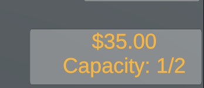  
  <em> Money counter and carrying capacity tracker</em>

### Mini-Map

The mini-map is one of the most vital components for the UI of the game as it directs the player to and from the restaurant and the customer's location. The minimap here not only helps the player navigate the world of the game but has various other effects, such as partially changing to be grayscale depending on the amound of fuel the player currently has. Also just next to the minimap is a more explicit fuel tracker that shows the player the exact amount of fuel they currently have.

    
  <em> The player has a minimap that helps them navigate the world and tracks their fuel.</em>

### Boost bar

The boost bars is located in the top left-hand side of the screen and will have 4 circles which will fill up once the player gains the boosts through their journey. These boosts will then disappear into an empty circle once the boost has been used.

  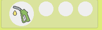  
  <em> Currently, this player has the fuel boost available</em>

### Time Counter

The time counter will be placed in the top center of the screen which counts down from 5-minutes to show how much longer the player has to maintain their fuel above 0 before the game ends

  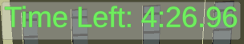  
  <em> Time Counter</em>

### Order information

Order information is displayed on the right hand side of the screen and lists all orders the player currently has. If a player is holding food it tells them they need to deliver it and also the current damage and heat of the food. If they have not picked up food for the order it instead indicates they need to go do so.

  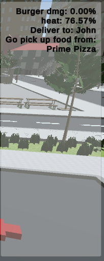  
  <em> Order information</em>

### Full UI

The UI looks like the image below currently.

  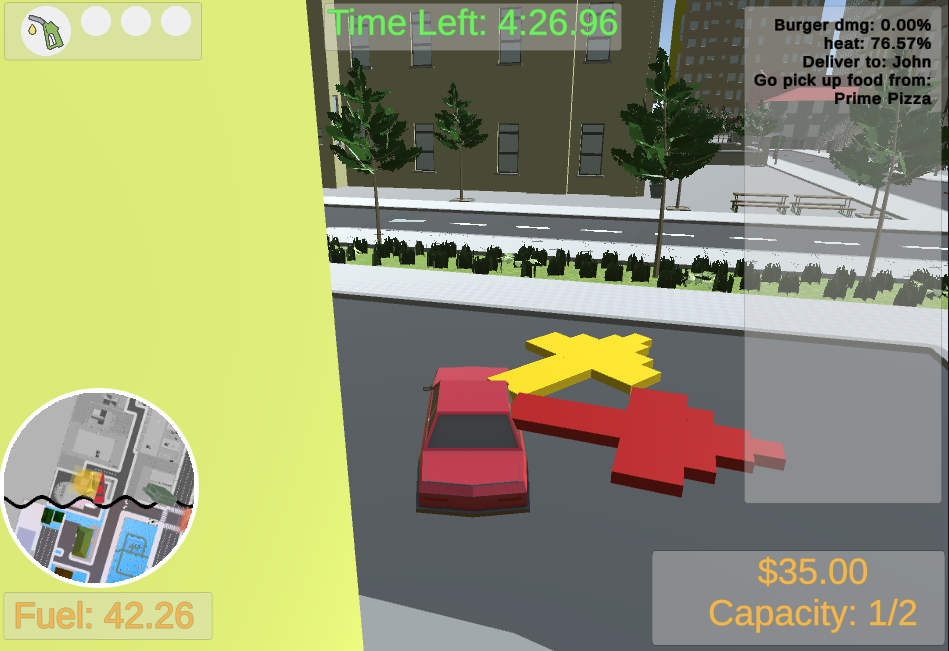  
  <em> Full UI example</em>

## Technology and Tools

We will be using the following software and tools in this project:

- Unity 2022.3.5f1 (LTS)
- GitHub
- C#
- [Visual Studio Code](https://code.visualstudio.com/) - Our IDE of choice
- [Blender 3.6 LTS](https://www.blender.org/) - 3D modelling software
- [Krita](https://krita.org/en/) - 2D art software

## Team Communication, Timelines and Task Assignment

Most of our communication will be done via discord server. This will allow us to separate communication onto different channels. For example, we will have a channel for general communication, one for issues, and others. Separating communication ensures that certain messages are not lost in the middle of other messages. We will also meet twice a week to discuss progress, these meeting will occur at:

- Monday 4pm
- Thursday 6pm

During these meetings, we will check in with everyones progress, and distribute work evenly.

Next steps will include incorporating boosts and the minimap and also expanding on what we already have for the game such as adding obstacles, a larger map and more customers.

## Possible Challenges

The main challenge we see as a team is the time constraint. We have agreed to complete our designated tasks by the agreed time so that we don't become overwhelmed towards the end of the project.
Fortunately, we have a broad range of skills in this team which covers most of the technical requirements for this project, which will help reduce the time constraint issue.
Budgetary constraints mean that there is a limited pool of assets we can use to help build our game. As we find potentially useful assets we have been and will continue to compile them into one channel of our discrod server, which keeps them organised and allows us to debate which assets to use in the game.
