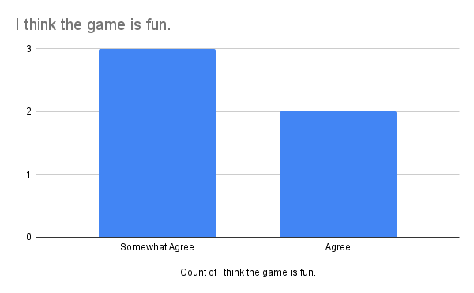
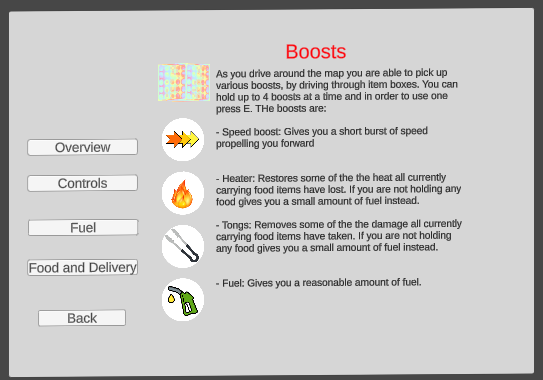
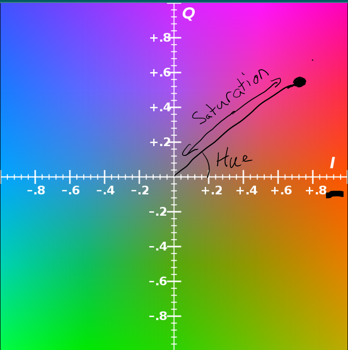

[](https://classroom.github.com/a/CibnTZFQ)

# Project 2 Report

Read the [project 2
specification](https://github.com/COMP30019/Project-2-Specification) for
details on what needs to be covered here. You may modify this template as you see fit, but please
keep the same general structure and headings.

Remember that you must also continue to maintain the Game Design Document (GDD)
in the `GDD.md` file (as discussed in the specification). We've provided a
placeholder for it [here](GDD.md).

## Table of Contents

- [Evaluation Plan](#evaluation-plan)
- [Evaluation Report](#evaluation-report)
- [Shaders and Special Effects](#shaders-and-special-effects)
- [Summary of Contributions](#summary-of-contributions)
- [References and External Resources](#references-and-external-resources)

## Evaluation Plan

In order to ensure our game is the best it possibly can be we will evaluate a version of it with groups of people who represent a portion of our target audience. Two different techniques will be used to assess the game, a questionnaire (a type of querying technique) and a cooperative evaluation (a type of observational technique). This should provide us with two distinct types of data sets which we can analyse to determine issues in our game. We shall allow ourselves time to address critiques and issues that arise in this evaluation so we can hopefully improve our game.

### Goals

Whilst doing the evaluation we need to keep in mind the goals of this part of the project:

- **Mechanics Testing**: To ensure that the game feels good to play from the user's perspective. That is do the controls feel responsive, the physics understandable and the consequences for poor actions fair?
- **Gameplay Assessment**: Is the core gameplay loop enjoyable for the player. Specifically, does repeatedly delivering food to customers remain engaging within the five minutes of play. Are our test players interested in playing more.
- **Accessibility**: Are the game's controls, systems and objectives obvious to players. If not how can we better address the user's needs.
- **Visuals and audio**: Are the game's visuals and audio appealing to players? How could they be improved? We should keep our limitations in mind during this stage as we can really only access assets from the unity asset store.
- **Bug checking**: Whilst we do our best to check for bugs during development, as we only have a small team by having a larger group of players play the game we may find issues that previously were unidentified.

### Evaluation techniques

We will use two different evaluation techniques during this stage:

- **Cooperative Evaluation**: This technique will involve asking the player to speak aloud as they play through the whole of Delivery Dash and also asking them to ask questions to the observer whilst they play. Additionally, the observer can give the players brief instructions if they notice them getting stuck. We want to use this technique as it creates a relaxed environment meaning the player may feel more confident giving critiques. Additionally, as it involves a dialogue between player and observer, the player will not end up getting stuck of frustrated for too long as the observer can give them advice when needed.
- **Questionaire**: The other technique we will use will involve less interaction by the observer. In these evaluation sessions, a player is asked to play a game all the way through by themself. After they have completed the game (whether by delivering all items or failing to do so) they are asked to fill out a set of questions to review their experience. This technique is mainly going to give us a set of quantitative data which we can easily use to determine what parts of our game may be working well and what other parts are currently being received poorly by players. The questionnaire is based on the GUESS-18 standard for judging games, which is described [here](https://uxpajournal.org/wp-content/uploads/sites/7/pdf/JUS_Keebler_GUESS-18%20Scoring%20Guidelines.pdf). A few questions where modified in order to better suit the game's current state, specifically questions to do with social aspects of the game. Some additional questions were added to get specific feedback on parts of our game. The questionnaire can be found here: https://docs.google.com/forms/d/e/1FAIpQLScJ39lEN-uDdZmrf8plSbG-9YokRIf9eK32MPSzFuMqeAzxzg/viewform?usp=sharing

#### Participants

To gather participants for the evaluation we will mainly be sourcing people from friends and family. As our game is supposed to have a casual appeal there is no requirement to seek out "hardcore" gamers. That said we still want to ensure the game is enjoyable for a variety of different people with different skill levels and in order to address this it is important to enquire about how many similar games like ours a player has played whilst asking for their feedback. Our goal is to collect at least 10 participants for evaluation, although we have planned to get 11 in total to ensure if one person is unable to participate we still reach our goal.

### Data collection

Our two different techniques require different ways of collecting data:

- **Cooperative Evaluation**: During the cooperative evaluation we will mostly be collecting qualitative data by noting down what users say and also observing their body language in response to situations in the game. Once a player has finished playing through the game the observer should write a brief summary of what the player did and said during their play time. This should be documented on either a Word document or text document and then saved to our github repo so we can track the feedback.
- **Questionaire**: As previously mentioned, the data collected by the questionnaire will mostly be quantitative with the addition of a text box for users to fill in give some feedback. In order to collect this data we will use a Google Form as it is easily accessible by users and takes minimal time to create.

### Data analysis

As we collect the qualitative data from both the cooperative evaluation and the questionnaire we will dot point parts of the game that are common critiques, specifically noting down proposed solutions that users come up with. We can then weigh up these solutions and decide if they are plausible fixes that we can implement.
In order to assist with if these critiques are common we can review the quantitative data from the questionnaire as we will use it to assess how much users enjoyed specific mechanics and parts of the game.
Additionally, after using this data to identify issues we need to actually determine if fixes are worth implementing. A change is unlikely to be implemented if:

- it does not align with our vision for Delivery Dash, that is implementing the change would completely alter the final output of the game in a way that neither fits the specs or matches our goals in creating the game.
- it is a small fix that would require substantial effort and changes to technical systems in our game
- it is a large change which we simply do not have time to implement and determine how the change would affect the other systems in the game.

### Timeline

Our goal is to complete the evaluation between the dates of October the 7th and October the 23rd. This gives us enough time to source participants, organise sessions for them to play test and then review and analyse the collected data. Additionally, this gives us another week to implement and test potential changes so we know the game is in the best possible state.

### Responsibilities: Who is responsible for each task? How will you ensure that everyone contributes equally?

The work of the evaluation is split into:

- Bee: Collecting five participants for the questionnaire portion, as the questionnaire section requires less involvement from the observer it can be run much quicker than the cooperative evaluation.
- Grace, Granth and Jeremy: Collect 2 participants each to do a cooperative evaluation session. This means the focus can be put onto these sessions to ensure we get the most detailed responses possible.
- Everyone: Review, summarise and address feedback from all evaluation sessions. Everyone needs to understand the issues that need to be fixed in the game.

## Evaluation Report

### Questionaire Results

The Questionaire was completed by five different participants over the course of a few days, the results of which can be found [here](https://docs.google.com/spreadsheets/d/1yF6CsMy5ays79xOmjg3_30l8fu3mTMDyHuZyhUfyH9s/edit?usp=sharing) in a Google Sheet. The particpants where 20-21 year olds and they did have a reaosnable familiarity with video games. Hence, their critiques of things like controls and understandability as if those parts of our game where judged poorly it would likely mean that less experienced gamers would also have trouble understanding how our game worked. Moreover, we also wanted to ensure the game was engaging even for experienced gamers and so were open to changing and adding mechanics to make the game more interesting if need be.

#### Discussion

We created some graphs to help us visualize the results of the questionaire and have included some notable ones below for discussion.

<p align="center">
 
 <em><br>Controls Bar Graph</br></em>
</p>
When asked about the controls in the game the most common response was that they "somewhat agree" the controls are straight forward. This is to be expected as we use WASD for movement which is rather standard across other games. Still, there is potential to probably improve how we communicate the controls to players.
<p align="center">
 
 <em><br>Story Pie chart</br></em>
</p>
We got more negative feedback for the games story with most of our players not feeling engaged with it at all. This was an expected repsonse as in game we provide little context for why the player is delivering food. While not a focus on what we want to impove it is still something we kept in mind when making alterations to our game.
<p align="center">
 
 <em><br>Fun Bar Graph</br></em>
</p>
The five players only gave us two different responses for "I think the game is fun" either "Somewhat Agree" or "Agree" whilst this response is not negative, there where no "Strongly Agree" repsonses indicating there is still some imporvements that could be made to make the game more exciting and fun for these experienced players.
<p align="center">
 
 <em><br>Minimap pie chart</br></em>
</p>
One of the additional questions we asked ontop of the GUESS-18 default questions was whether players thought the minimap was neccesary in the game. At this point in development we had not developed a minimap to help players navigate the world, instead opting for just using the colour coded arrows that pointed in the direction of restaurants or customers the player needed to go to. We mainly wanted to figure out if it was worth attempting to implement a minimap at this stage in development or if our effors should be focused on different tasks. Based on the feedback we got here a majority of our players seemed to strongly agree the world needed a minimap to help you navigate it.

Another major aspect reported by the participants was the use of music in the game. Participants believed that the music used was engaging ans majority of the participants selected "Agree" or "Somewhat agree" when asked if the background muusic and the sound effects were engaging enough. As sound effects are another major aspect of any game it was important that participants liked and become hooked to the music.

Alongside music interactions, the participants also asserted their involvement and focus of their performance while playing the game. This again is indicative that the participants are truly indulged in the game and care about the outcome.

### Cooperative Evaluation Results

Of the five participants who took part in the Cooperative Evaluation, two were female and the other three preferred not to state their gender, the ages of the participants ranged from 21 to 23.

A brief summary of the participants can be found below:

**Participant 1: Female, 23 years old**

The participant first read the instructions and then decided to start on the bus and immediately stated that "this is too slow." After not getting very far (and seemingly getting frustrated) she then decided to use the car. Unfortunately, despite reading the instructions, the participant had no idea that the arrows fixed on the car was where the restaurant was and was confused on where to go stating "I don't see any food [to pick up]"
The participant ultimately ran out of time and asked "don't I get to see how I did?" when being sent back to the menu screen.

**Participant 2: Female, 21 years old**

The participant read the instructions and then started by playing the car, before getting stuck in the road and had to restart. She chose the car again and after being told to follow the arrows, she successfully made a delivery but lamented that she "only got a $0 tip" to which the observor noted that she was too slow. At one point during the playthrough, the participant passed by an item box, not knowing what it was. Upon learning that it was a boost, she confidently said "I don't need that." After several playthroughs, the participant finally managed to deliver all 5 orders before noticing, it was easy to finish within 4 minutes as "the map was always the same".

**Participant 3: 22 years old**

This participant read the instructions and selected the station wagon. They were able to successfully control the car very easily however did not fully understand how the item boxes functioned. They weren't able to locate the item boxes and needed guidance with this, they also noticed that the map was identical each time.

**Participant 4: 22 years old**

This participant selected the bus and quickly regretted their choice stating "it is so slow". They also drove into buildings whilst following the arrow directions.

**Participant 5: 21 years old**

This participant suggested the use of the minimap to be able to see where food was more holistically. This participant was also pleasantly surprised by the added music and had a great time playing the game. They didn't understand how the boosts worked however, resulting in receiving no tips.

#### Cooperative Evaluation Discussion

Common questions asked by the participants mostly involved the mechanics of the game, such as "Do I need to do anything or does it automatically pick up the food?", "What do the arrows mean?". This suggests that the instructions page could be improved so that players have a better understanding of the game.

Several participants also did not like the fact that they were blindly following arrows, especially when it lead them into a wall and suggesting the game would be better if they could see more roads.

The game appeared to be quite fun and engaging for participants, the majority of them deciding to play again if they failed, so that they could "win" and after winning, kept playing in order to beat their high score or to try the other vehicles.

The bus was not a very popular option as it was deemed quite slow, but one participant did like how it gave the game an extra layer of difficulty and enjoyed the "diversity" the game offered.

#### Changes

After considering the feedback from the questionaire and cooperative evaluaion we made a variety of alterations to help us improve our game:

- **Instruction Page:** In order to clarify not only the controls of our game but also the objectives and mechanics of our game we redeveloped our instruction screen with different pages, with one specifically for the different controls in the game. Moreover we added clarification in the new overview page for the game's story. We did not want to overcomplicate this page though so we only kept enough to keep the players engaged.
<p align="center">
 
 
 
 <em><br>Some of our new Instruction pages</br></em>
</p>

- **Fuel Mechanic:** We added a new mechanic to our game in the form of fuel, which decreases over the course of the game and that players need to spend their collected tip money to refuel. We hoped this mechanic would produce more fun and interesting moment-to-moment game play as players have to make more interesting decisions on keeping track of their fuel as they make deliveries. This also added further consequence to delivering cold and damaged food as it meant players would not be able to afford the fuel they needed to continue the game. Additionally, this mechanic further aligned our game with the specifications requirment of being a survival game.
<p align="center">
 
 
 <em><br>The in-game explanation of our fuel mechanic and refueling in action</br></em>
</p>

- **Minimap:** As previously mentioned, we where unsure if our game required a minimap, but based on the feedback it became evident it would be a good idea to implement one. To ensure the minimap was legible we had the player and objective locations be made more prominent by giving them a pulsing effect. Additionally, we decided the minimap would be a good place to implement one of the shaders we needed to make as a way to make the minimap appear both visually interesting and clear to the player.
<p align="center">
 
 <em><br>The new minimap</br></em>
</p>

- **Game Over:** We also redid the Game Over Message to be personalised based on whether you ran out of time, or ran out of fuel. Now you would be able to see how much tip you received instead of being sent straight to the main menu. We hoped this would aid in replayability as players set themselves goals, either getting more tips or not running out of fuel.

## Shaders and Special Effects

### Shader 1: Minimap

#### Context

In order to develop a visually appealing, clear but interesting minimap we utilised a shader effect on the camera that looks down upon the player from a birds eye view. The shader file itself can be found [here](https://github.com/COMP30019/project-2-n-o-p-e/blob/main/Assets/Shader/miniMapFilter.shader). Before explaining the shader itself let us explain just the basic workings of our minimap camera:

<p align="center">
 
  
 
 

<em><br>Minimap Objects, renderer and Camera</br></em>

</p>

- First we have a parent object "Minimap" which is used to interface between the components of the minimap child components, such as the shader, and other outside game obejcts. The interfacing is done through the [Minimap Settings script](https://github.com/COMP30019/project-2-n-o-p-e/blob/main/Assets/Scripts/MinimapSettings.cs) which also ensures that the minimap camera follows the players character by setting what target the camera should follow.
- "minimapCamera" is the camera object which has the shader filter applied to it. It looks direclty down on the player rotating and following it by checking the target set by the parent Minimap. It has one script component [miniMapFollow](https://github.com/COMP30019/project-2-n-o-p-e/blob/main/Assets/Scripts/miniMapFollow.cs) which handles target following. Note this camera only renders things from layers 'Default' and 'minimap' as we wnated to avoid apply filters to icons that indicate objects, item boxes and the player character to ensure the map is still clear.
- "minimapAgents" is another camera that only displays objects from the Agentsminimap layer, this layer contains things like an enlarged player model (positioned far out of view of the actual player character) which follows the player overhead (and not rednered by the main camera). The filters applied to the other objects not on this layer by the main "minimap" camera are not applied here to ensure clarity for the player.
- "Image" and "mask" are just objects that ensures the minimap is displayed as a circle with a small white circular border.
- "minimapRaw" and "minimapRawAgents" are where the output of the two minimap cameras is rendered to make them viewable to the player. minimapRaw has the material "filter" applied to it in order to render the view from the camera with our shader effect.
  The intial layout of minimap objects to create a view was based on a tutrial by Sunny Valley Studios [How to make Minimap in Unity 2021 (works for multiple floors)](https://www.youtube.com/watch?v=3HIQu2GsOJs).

#### Overview

Initially when developing the shader we wanted it to simplify the colours displayed to the player so that it did not intially look so cluttered, one potential way we thought to do this was by applying a shader filter to the camera to create a more easily understandable view of the map from a birds eye. One way this could be achieved was by lowering the saturation of the pixels. We found a tutorial by Benjamin Swee on [Hue, Saturation and Brightness](https://www.youtube.com/watch?v=kiSKb54cogo) modifying camera filter. The way the shader in this tutorial worked was by converting the rbg values of the pixel to YIQ, Y representing the "Luma" (equivalent to brightness), I meaning "in-phase" and Q meaning "quadrature". More specifically, both I and Q relate directly to the colour of the pixel as seen on the plot of IQ values below.

<p align="center">
 
 <em><br>Plot of IQ values</br></em>
</p>
In order to convert to YIQ values we had to define a matrix and multiple the rgb vestor of the pixel by it, and then when it came time to convert YIQ to rgb we agan had to define a different matrix to mutiply the YIQ vector by.

```
float3x3 RGB_YIQ = float3x3 (0.299,0.586,0.114,
                            0.595,-0.275, -0.3213,
                            0.2115, -0.5227, 0.3112);
float3x3 YIQ_RGB = float3x3 (1, 0.956, 0.619,
                            1,-0.272,0.647,
                            1, -1.106, 1.702);

float3 YIQ = mul(RGB_YIQ, RGB);
float3 RGB = = mul(YIQ_RGB, YIQ);
```

Using that YIQ values we are able to:

- Change the Brightness of the pixel by directly altering the Y value
  `float Y=YIQ.x+ _Brightness;`
- Alter the Stauration and Hue of the pixel by using circular functions to change the coordinate of the pixels colour on the IQ plane. We change the stauration by increasing the distance between the centre of the plane (0,0) and the location of where the coordiante will be done. In code this looks like taking the original IQ distance to (0,0) and multiplying it by a saturation value `length(float2(YIQ.y, YIQ.z)) *sat;` which we can define as some value between 0 and 5. In order to change the hue we find the current angle of the line from (0,0) to IQ to the I axis. We can then alter that by adding a hue modifcation to the angle to define our new hue `hue = atan2(YIQ.z,YIQ.y) + _HueShift`
- Finally then we can find the new I and Q coordinates using `float I = chroma * cos(hue);` and `float Q= chroma * sin(hue);`, which then putting it all togthere we get a new YIQ vector `float3 shiftYIQ = float3(Y,I,Q);` which can then be converted back to RGB.
<p align="center">
 
 <em><br>Plot of IQ values with Hue and Saturation</br></em>
</p>
Bringing these parts togethere our code come out like this before the future modifications we would make (Full definitions of shader properties excluded for brevity):

```
float3x3 RGB_YIQ = float3x3 (0.299,0.586,0.114,
                                         0.595,-0.275, -0.3213,
                                         0.2115, -0.5227, 0.3112);
                float3x3 YIQ_RGB = float3x3 (1, 0.956, 0.619,
                                            1,-0.272,0.647,
                                            1, -1.106, 1.702);


float3 YIQ = mul(RGB_YIQ, color);
float hue;
float dist= length(v.uv);
float brit = _Brightness;
hue = atan2(YIQ.z,YIQ.y) + _HueShift;
sat= _Saturation;


float chroma = length(float2(YIQ.y, YIQ.z)) *sat;

float Y=YIQ.x+ brit;
float I = chroma * cos(hue);

float Q= chroma * sin(hue);
float3 shiftYIQ = float3(Y,I,Q);

float3 newRGB = mul(YIQ_RGB, shiftYIQ);

```

From this code we tested out various values for out shader properties (\_Saturation, \_Brightness, \_HueShift) which resulted in our minimap having an overall hue shift and saturation reduction which did help it make more understandable. In order to better integrate the minimap into our game and make it visually interesting we conitnued to modify the above code resulting in a more unique and interesting shader effect.

#### Circular Hue Change

<p align="center">
 
 <em><br>Minimap changing hue centred around the players</br></em>
</p>
The first change we made to the shader was to have the hue of a pixel dynamically change based on its .uv postion and the current time with the aim of having it appear that the hue was changing in a circular pattern around the player. This was achieved by using a sin function that relies on the current time and the distance of the uv coordinate to the centre of the camera (0.5,0.5). We multiply this distance by 2 in the sin function to keep it in a range of -1 to 1 which gives more distinct patterns.

```

float dist= length(v.uv - (0.5f,0.5f));
float brit = _Brightness;
hue = atan2(YIQ.z,YIQ.y) + _HueShift + sin(_Time.y + dist*2);

```

#### Fuel tracking

<p align="center">
 
 <em><br>Minimap  tracking fuel</br></em>
</p>
One of the most noticeable changes we made was to have the minimap be used to visually track the player's current fuel by having the amount of the map with 0 saturation increased as the player lost more and more fuel. In order to check the height of where the regularly saturated part should go up to we created a new property in the shader "_HeightSaturation". The value of this is determined in the [Order Creator script](COMP30019/project-2-n-o-p-e/Assets/Scripts/OrderCreator.cs), as it tracks the player's fuel, which has a reference to the MinimapSettings component in the "Minimap" object and makes the call minimapSettings.setFuel(fuel/Maxfuel);  which will ensure that the value of "_HeightSaturation" is between 0 and 1. The MiniMapSettings script then using its reference to the minimapRender sets the "HeighSaturation" property.

```

public void setFuel(float height) {
        minimapRender.SetFloat("_HeightSaturation", height);
}

```

Now that the minimap shader has a value relative to the amount of fuel the player we can do work in the shader to make this effect visually appealing and understandable. In order to do this, rather than using the exact \_HeighSaturation value as the maximum v value of pixels that will be saturated we can instead base it on that pixels v value plus a sin function that depends on the both the pixels v value and the current time. This creates the effect of a wave-y line of saturated and unsaturated pixels which makes it easier to see ontop of the minimap but also makes it visually similar to the sloshing of fuel inside of a car engine.

```
if (_HeightSaturation > v.uv.y + sin(_Time.y+v.uv.x*30)/40) {
                    sat = _Saturation;
}
```

Moreover in order to make the difference between unsaturated and saturated pixels more prominent we can create an outline around this sin create wave by setting the brightness of all pixels just above that wave to 0, making them appear black.

```
else if (_HeightSaturation +0.02 >= v.uv.y + sin(_Time.y+v.uv.x*30)/40) {
                    brit = -1;
}
```

Finally we can set the saturation of all pixels that are above this wave to be 0 which gives them effect of being grayscale rather than coloured.

```
else {
    sat = 0;
}

float chroma = length(float2(YIQ.y, YIQ.z)) *sat;

```

#### Successful dropoff or pickup

<p align="center">
 
 <em><br>Effect when a player successfully delivers or pickups a food item</br></em>
</p>
Another change we made was to have the minimap change in response to a player successfully delivering or picking up food. This was done again using the OrderCreator script which calls the minimap settings script when ever food is delivered or picked up.

```
minimapSettings.success();
```

from there the Minimap settings script increase the brightness of the minimap to the maximum of 1.0 creating an effect where the minimap flashes white. After that over the next second it reduces the brightness back down to the regular level using a coroutine.

```
public void success() {
    if (successNow==false) {
        successNow = true;
        minimapRender.SetFloat("_Brightness", 1.0f);
        StartCoroutine(successRun());
    }

}
IEnumerator successRun()
{
    Debug.Log(successNow);
    float start_time = Time.time;
    while (Time.time - start_time<1) {
        minimapRender.SetFloat("_Brightness",1.0f-(Time.time - start_time));
        yield return new WaitForSeconds(.01f);
    }
    successNow=false;

    minimapRender.SetFloat("_Brightness", 0.0f);


    yield return null;
}

```

From there we created similar effects for when a player crashes, refuels or uses a boost.

#### Crashing

<p align="center">
 
 <em><br>Effect when a player crashes into an object in the world</br></em>
</p>
Similar to the effect when the player drops off or picks up food we created an effect that breifly decreases the saturation on all parts of the map before raising it up to regular levels. It is again called by OrderCreator, which does so when it is told to deal damage to the food (indicating a crash).

```
minimapSettings.collided();
```

The minimap settings script then first decreases the Saturation to 0 before increasing it back to normal over a second, can be seen in the collsion() and collisionRun() in the minimapSettings script.

#### Refuel and Boost

<p align="center">
 
 <em><br>Effect when a player crashes into an object in the world</br></em>
</p>
The final alteration to the shader was to create an effect that increases the frequency of the dynamic hue changes in response to a player using a boost or refueling at the gas station. This was done by defining a "_Frequency" property in the miniMapFilter shader, defualting to 1.0, which is then used in the calculation of the shifted hue.

```
hue = atan2(YIQ.z,YIQ.y) + _HueShift + 2*sin(_Time.y*_Frequency + dist*2);
```

Now this Frequency is changed in repsonse to the use of a boost or refueling in OrderCreator which calls minimapsettings.

```
minimapSettings.boost();
```

The minimap settings script, similar to before, first increases the Frequency to 10 before decreasing it 1, this time over the course of 3 seconds to make the effect more prominent. This occurs in the boost() and boostRun() functions in the minimapSettings script.

#### Having the Results show

In order to actually show these effects on the minimap we had to create a new instance of a material on each update so that the material applied to the image texture on the minimapRaw component would be rendered with these new effects. This was done in minimapSettings by creating a new material based on the current state of the material in the minimapRaw component, then updating the values of that during this frame and at the start of the next frame setting minimapraw's material to this new material.

```
void Update() {
        miniMap.GetComponent<RawImage>().material= minimapRender;
        minimapRender= new Material( miniMap.GetComponent<RawImage>().material );

}
```

### Shader 2: Item Box

#### Overview

Our [second shader](https://github.com/COMP30019/project-2-n-o-p-e/blob/main/Assets/Shader/ItemBox/ItemBoxShader.shader) was used to create a visually appealing item box. Our main source of inspiration was basing the item box off the widely known item box that appeared in Mario Kart games, which consisted of a question mark encased in a semi-transparent speckled rainbow cube.
We found a youtube tutorial by [Jettelly](https://www.youtube.com/watch?v=4p0YvPHO4Wc&ab_channel=Jettelly) which showed how to make the item box with ShaderGraph. While we did not use ShaderGraph, the tutorial was nonetheless helpful in showing how to create the semi-transparent and floating question mark effect.

#### Speckled Rainbow Cube

The Speckled Rainbow Cube was created using two textures and a Grayscale version of the ColorCorrection effect. The first texture `_MainTex` is a Grayscale image that consists of the speckled pattern appearing on the cube. The pattern itself consists of two layers, the back layer consists of various horizontal grayscale stripes, while the front layer consists of a light gray centre and a dark border. The front layer also has 25 identical circles cut out of it in a 5x5 array pattern to reveal the back layer.
Meanwhile the second texture `_RampTex` is a vertically striped rainbow coloured image. Both images were created in Krita using the blur filter to ensure that the colours changed seamlessly from pixel to pixel

<p align="center">
  
 <em><br>Left: _MainTex, Right: _RampTex</br></em>
</p>

When the fragment shader assigns colour to each pixel, it first grabs the grayscale colour of the pixel in the corresponding UV coordinate of `_MainTex`, it then creates of a deformation value based on the value of the grayscale colour and time: `displacement factor = "grayscale" + "time elapsed"`.
The deformation value is then added to the U coordinate of the UV coordinates and we take its fractional part to get a new set of coordinates: `new UV = (original UV + [displacement factor, 0]) % 1`.
Using our new UV coordinates we grab the colour of the pixel in `_RampTex` and return it resulting in a Speckled Rainbow Cube.

#### Semi-transparentness and Floating Question mark

When looking at the Mario kart item box, players can see through the front faces inside the cube, but do not see past the back faces. To simulate this, we used Front Culling to only render the inside of the cube. The front faces were then rendered as a separate transparent cube and overlayed in the same position.

The floating question mark was made with a particle system with emission and speed set to 0. This allowed the question mark to face the camera no matter what angle the camera made with the item box.

The final result is as follows:

<p align="center">
 
 <em><br>Item Box</br></em>
</p>

### Particle System

#### Item Box Explosion: explosion.prefab

This Particle System represents the collection of an Item Box. The duration is set to 0.2 with small particles to appear as if the item box exploded. Auto Random Seed has been set to true so that each time there is a different generation of particles for each generated Particle System.

<p align="center">
 
 <em><br>Item Box Particle System</br></em>
</p>

## Summary of Contributions

| Name   | Contributions                                                                                                                                                                                                                                                                                                                |
| ------ | ---------------------------------------------------------------------------------------------------------------------------------------------------------------------------------------------------------------------------------------------------------------------------------------------------------------------------- |
| Bee    | <ul><li>Order Managment script</li><li>Sound effects and background music</li><li>Food managment (heat loss and damage taking)</li><li>Minimap and its shader</li><li>Evaluation Plan</li><li>Questionaire and relevant part of Evaluation Report</li><li>Additional instruction pages</li><li>GDD and report work</li></ul> |
| Jeremy | <ul><li>Vehicle Movement</li><li>Menu Screen</li><li>Particle System</li><li>Key Input</li><li>GDD</li><li>Cooperative Evaluation</li></ul>                                                                                                                                                                                  |
| Grace  | <ul><li>Boosts logic</li><li>Item box shader</li><li>5 minute timer</li><li>QOL changes</li><li>Cooperative Evaluation</li></ul>                                                                                                                                                                                             |
| Granth | <ul><li>Entire map</li><li>Main screen</li><li>Report</li><li>GDD</li><li>Cooperative Evaluation</li></ul>                                                                                                                                                                                                                   |

## References and External Resources

### Research and Tutorials

YIQ. (2023, September 30). In Wikipedia. https://en.wikipedia.org/wiki/YIQ
Swee, B. (2022). Hueshift, saturation, and brightening all in one shader in Unity. Retrieved from https://www.youtube.com/watch?v=kiSKb54cogo
Sunny Valley Studios. (2021). Retrieved from https://www.youtube.com/watch?v=3HIQu2GsOJs
Jettelly | VFX & Shaders. (2023, October 27). How to make MARIO KART Item Box in Unity \[Video\]. Youtube. https://www.youtube.com/watch?v=4p0YvPHO4Wc

### Assets

Unity Asset store

- [CITY Package from 255 Pixel Studio](https://assetstore.unity.com/packages/3d/environments/urban/city-package-107224) for the city
- [Simple Cars Pack by MyxerMan](https://assetstore.unity.com/packages/3d/vehicles/land/simple-cars-pack-97669) for the vehicles
- [Distant Lands free Chracters by Distant Lands](https://assetstore.unity.com/packages/3d/characters/distant-lands-free-characters-1781231) for customer models
- [free Casual Food pack - Mobile/VR by Lumo-Art 3D](https://assetstore.unity.com/packages/3d/props/food/free-casual-food-pack-mobile-vr-85884) for the food models
- [Fuel Tank 10 L by AK STUDIO ART](https://assetstore.unity.com/packages/3d/props/fuel-tank-10l-230694) for the fuel tank
- [Vehicle - Essentials by Nox_sound](https://assetstore.unity.com/packages/audio/sound-fx/transportation/vehicle-essentials-194951#content) for the sounds of our vehicles

Additional sound effects and music:

- [Cruising down 8 bit lane](https://pixabay.com/music/video-games-cruising-down-8bit-lane-159615/) for background music
- [Car Crash EXT by Pixabay](https://pixabay.com/sound-effects/car-crash-ext-6388/) for the sound of the car colliding into map objects
- [Boost](https://pixabay.com/sound-effects/boost-100537/) when activating a speed boost
- [3 up 2](https://pixabay.com/sound-effects/3-up-2-89189/) when picking up a power up
- [steam_burst](https://pixabay.com/sound-effects/steam-burst-6822/) for when a heater boost is used
- [Sword Hit](https://pixabay.com/sound-effects/sword-hit-7160/) for when the tongs boost is used
- [ding](https://pixabay.com/sound-effects/ding-36029/) for when food is picked up
- [Success Fanfar Trumpets](https://pixabay.com/sound-effects/success-fanfare-trumpets-6185/) for when te game ends after five minutes
- [Tada Fanfare A](https://pixabay.com/sound-effects/tada-fanfare-a-6313/) for when food is delivered
